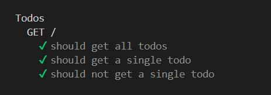

# unitesting-nodejs

repo yang digunakan untuk pengujian unitesting MERN

untuk melakukan pengujian dapat mengeksekusi peritah sebagai berikut :

```
$~ npm run dev
```

kemudian untuk melakukan testing terhadap API yang dibuat dengan menggunakan postman, dapat mengakses

```
http://localhost:4004/todos
```

maka akan menghasilkan array object di respond

Hasil pengujian yang akan tampak seperti pada gambar dibawah ini :


